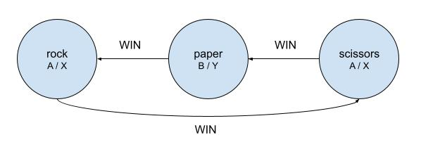

# Learning diary

This document summarizes what I have learned during this challenge.

## Days 01-03

Problems felt achievable but I had some issues with applying the correct syntax. Some time was also wasted on logical errors in code or just not understanding the problem correctly. The time completing both parts stayed around two hours, (except the first day took only an hour). I decided not to polish my code too much, but to apply the lessons learned during the day to the next day.

I learned

* to read the instructions carefully (this will save at least 10-30min of frustration).
* how to use common [data structures in C++](<https://en.cppreference.com/w/cpp/container>).
* handling of [strings and characters in C++](<https://en.cppreference.com/w/cpp/string/basic_string>).
* applying [algorithms library in C++](<https://en.cppreference.com/w/cpp/algorithm>) to different problems.
* `std::string::find()` returns `std::string::npos` when string of characters is not found, but `some_string[out_of_bounds]` returns `\0` which represents the termination of a string.
* to apply [modular arithmetics](<https://www.khanacademy.org/computing/computer-science/cryptography/modarithmetic/a/)what-is-modular-arithmetic>).
* to apply [graphs](<https://en.wikipedia.org/wiki/Graph_(abstract_data_type)>). E.g. rock-paper-scissors (day2) problem turned into a graph (part 2 needs "LOOSE" edges):

## Day 00

I completed day 1 of 2021 to create a template for myself this year.

The first part was straightforward and quick to do. However, the second part took longer because at first I read the instructions wrong and the problem became more complicated in my head than it was (e.g. the format of the input did not change). After realizing the mistake and understanding the task, the problem took less than 30min.

I learned how to read text files and how to implement queues in C++. I also learned how to set up a C++ project and how to automate build and launch in VScode.

Resources used:

* <https://www.w3schools.com/cpp/cpp_files.asp>
* <https://en.cppreference.com/w/cpp/io/basic_fstream>
* <https://en.cppreference.com/w/cpp/container/deque>
* <https://stackoverflow.com/questions/9148488/how-do-i-compile-c-with-clang>
